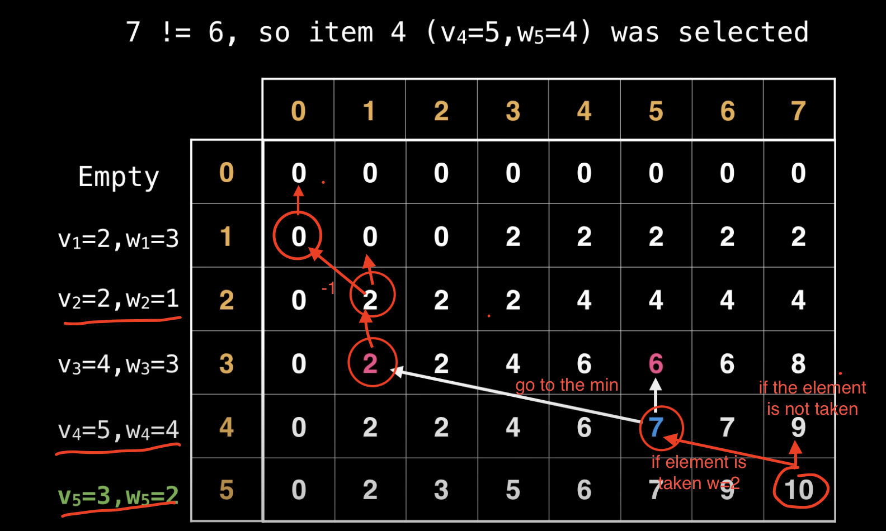

# 0/1 Knapsack Problem (Dynamic Programming Solution)



## Problem Description

The 0/1 Knapsack problem is a classic optimization problem. Given a set of items, each with a weight and a value, determine the number of each item to include in a collection so that the total weight is less than or equal to a given limit and the total value is as large as possible.

In the 0/1 Knapsack problem, you can either take an item or leave it (0 or 1), unlike the fractional knapsack problem where you can take fractions of items.

## Approach

This solution uses dynamic programming to solve the 0/1 Knapsack problem efficiently. The algorithm builds a table where each entry `dp[i][w]` represents the maximum value that can be achieved with the first `i` items and a maximum weight of `w`.

### Algorithm Steps:

1. Create a 2D array `dp` of size `(n+1) x (capacity+1)`, where `n` is the number of items.
2. Initialize the first row and column of `dp` with 0.
3. For each item `i` and weight `w`:
   - If the weight of the current item is less than or equal to `w`:
     - Take the maximum of including the item (`dp[i-1][w-weight] + value`) or excluding it (`dp[i-1][w]`).
   - Else:
     - Exclude the item (`dp[i-1][w]`).
4. The value in `dp[n][capacity]` gives the maximum value that can be achieved.
5. To find the selected items, backtrack through the dp table.

## Complexity Analysis

- Time Complexity: O(n * capacity), where n is the number of items and capacity is the maximum weight the knapsack can hold.
- Space Complexity: O(n * capacity) for the dp table.

## Usage

```go
items := []Item{
    {Weight: 10, Value: 60},
    {Weight: 20, Value: 100},
    {Weight: 30, Value: 120},
}
capacity := 50

maxValue := Knapsack(items, capacity)
fmt.Println("Maximum value:", maxValue)

maxValue, selectedItems := KnapsackWithItems(items, capacity)
fmt.Println("Maximum value:", maxValue)
fmt.Println("Selected items:", selectedItems)
```

## Implementation Details

The package provides two main functions:

1. `Knapsack(items []Item, capacity int) int`: Solves the 0/1 Knapsack problem and returns the maximum value.
2. `KnapsackWithItems(items []Item, capacity int) (int, []Item)`: Solves the 0/1 Knapsack problem and returns the maximum value along with the selected items.

The `Item` struct is defined as:

```go
type Item struct {
    Weight int
    Value  int
}
```

## Testing

The implementation includes a test suite that covers various scenarios:

1. Basic knapsack problem
2. Cases where no items fit
3. Cases where all items fit
4. Empty knapsack

To run the tests, use the following command:

```bash
go test
```

## Advantages of Dynamic Programming

- Optimal solution: Guarantees to find the best possible combination of items.
- Efficiency: Avoids redundant calculations by storing intermediate results.
- Flexibility: Can be easily modified to handle variations of the knapsack problem.

## Applications

- Resource allocation in financial management
- Cargo loading and logistics optimization
- Project selection under budget constraints
- Cutting stock problems in manufacturing

This dynamic programming solution to the 0/1 Knapsack problem provides an efficient and optimal approach to a classic combinatorial optimization problem, with applications in various fields including finance, logistics, and resource management.

## Video Explanation

[0/1 Knapsack problem | Dynamic Programming](https://www.youtube.com/watch?v=cJ21moQpofY)
