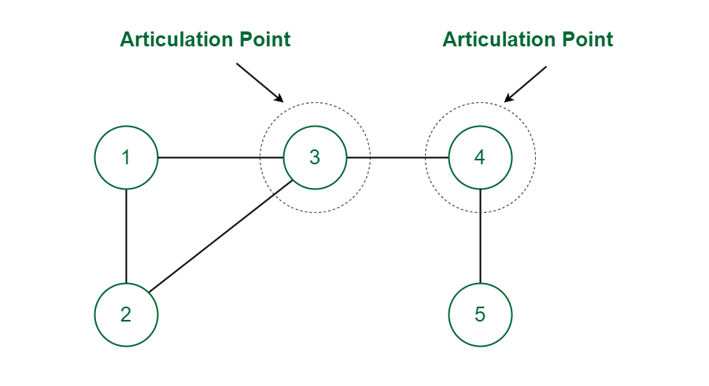

# Finding Articulation Points in a Graph



## Problem Description

Implement an algorithm to find all articulation points in an undirected graph. An articulation point (or cut vertex) is a vertex whose removal increases the number of connected components in the graph.

## Approach

The algorithm uses a depth-first search (DFS) traversal to identify articulation points. It keeps track of the following information for each vertex:

1. Discovery time: The time at which a vertex is first visited during the DFS.
2. Lowest discovery time: The earliest discovered vertex that can be reached from the subtree rooted at the current vertex.
3. Parent: The parent of the current vertex in the DFS tree.

A vertex is an articulation point if one of the following conditions is true:

1. It is the root of the DFS tree and has two or more children.
2. It is not the root, and it has a child whose lowest discovery time is greater than or equal to the discovery time of the current vertex.

The algorithm uses a single DFS traversal to find all articulation points, making it efficient for large graphs.

## Complexity Analysis

- Time Complexity: O(V + E), where V is the number of vertices and E is the number of edges in the graph. We perform a single DFS traversal of the graph.
- Space Complexity: O(V), where V is the number of vertices. This space is used to store the visited array, discovery time array, lowest discovery time array, parent array, and the articulation points array.

## Usage

```go
// Create a new graph with 5 vertices
g := NewGraph(5)

// Add edges to the graph
g.AddEdge(1, 0)
g.AddEdge(0, 2)
g.AddEdge(2, 1)
g.AddEdge(0, 3)
g.AddEdge(3, 4)

// Find articulation points
articulationPoints := g.FindArticulationPoints()

fmt.Println("Articulation points:", articulationPoints)
```

## Implementation Details

The package provides the following main components:

1. `Graph`: Represents an undirected graph using an adjacency list.
2. `NewGraph`: Creates a new Graph with the given number of vertices.
3. `AddEdge`: Adds an undirected edge to the graph.
4. `FindArticulationPoints`: Finds all articulation points in the graph using a DFS-based algorithm.

The `FindArticulationPoints` function uses a depth-first search approach to identify articulation points. It keeps track of discovery times, lowest discovery times, and parent information for each vertex. The function returns a slice of integers representing the articulation points in the graph.

## Testing

The implementation includes a comprehensive test suite that covers various scenarios:

1. Simple graph with one articulation point
2. Graph with no articulation points
3. Graph with multiple articulation points
4. Disconnected graph
5. Linear graph

To run the tests, use the following command:

```bash
go test
```

## Advantages of Finding Articulation Points

- Identifying critical nodes in a network
- Improving network reliability by reinforcing articulation points
- Analyzing the structure and vulnerabilities of complex systems

## Applications

- Network analysis: Identifying critical nodes in computer networks, social networks, or transportation systems
- Infrastructure planning: Determining vulnerable points in utility networks (e.g., power grids, water supply systems)
- Biology: Analyzing protein-protein interaction networks to identify key proteins
- Supply chain management: Identifying critical suppliers or distribution centers

The articulation points algorithm is a powerful tool for understanding the structure and vulnerabilities of various types of networks and graphs. By identifying these critical points, it becomes possible to improve the robustness and reliability of systems in many different domains.
